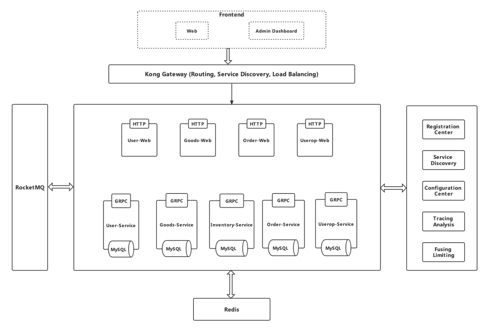

# Microservices-E-Commerce-Web

Gin+gRPC+Gorm+Mysql+Redis+Docker+RocketMQ+kong+Consul+Nacos+jaeger+sentinel

## Architecture

## Features

##### User Service

- The CRUD of User

##### Goods Service

- The CURD of goods, brands, categories, banner

##### Inventory Service

- The CRUD of inventory
- Using redis-based **distributed lock**, **transaction**, and  roll back inventory to ensure data consistency

##### Order Service

- The CRUD of orders and shopping cart
- Using RocketMQ to realize the **distributed transaction** among different (order, goods and inventory) services based on eventual consistency of reliable message 
- Using timed task of rollbacking inventory when order is not paid in long time

##### Userop Service

- The CRUD of address, comment and favorites

------------------------------------------------------------------------------------------------------------------------------------------------------------------

#### User Web, Goods Web, Order Web, Userop Web

- JWT authorization
- Form validation
- Listen http requests and call related services through gRPC
- Presigned URL of AWS S3

## Service Governance

- Registration Center and Service Discovery: Consul
- Configuration Center: Nacos
- Tracing Analysis: Jaeger
- Fusing and Limiting: Sentinel

## Deployment

- AWS EC2 
- Docker